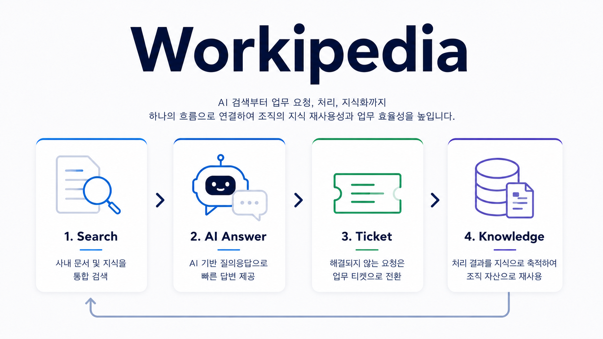
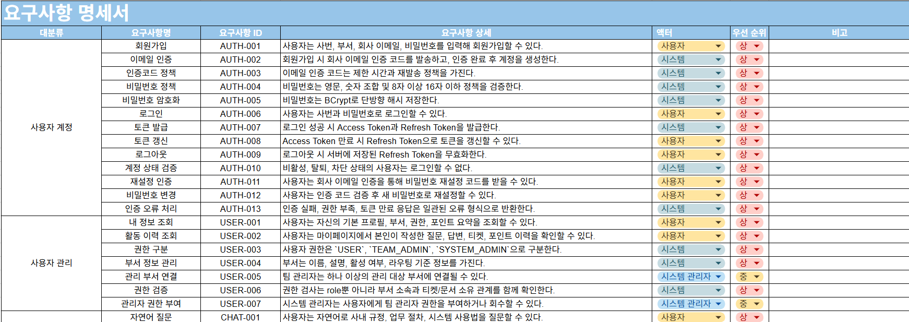
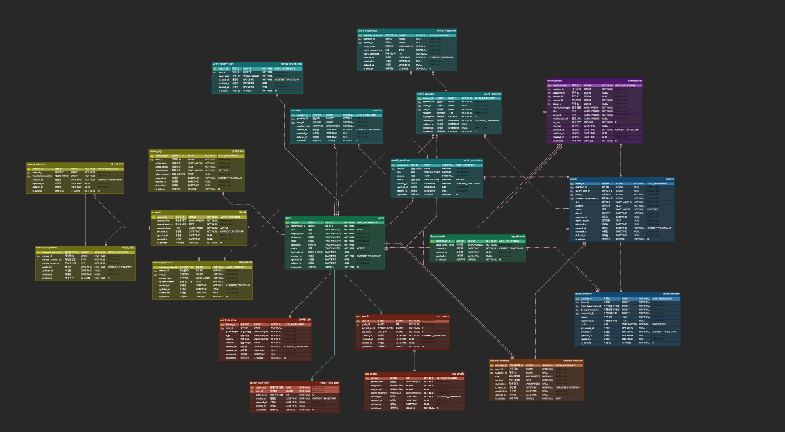
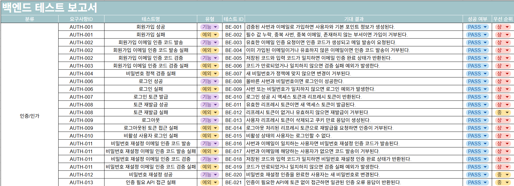
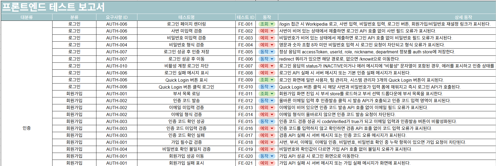
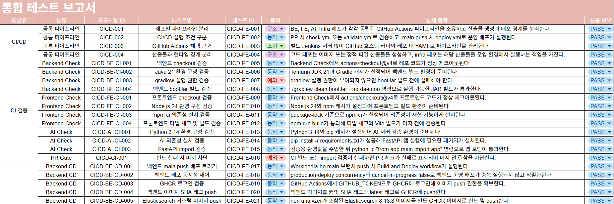
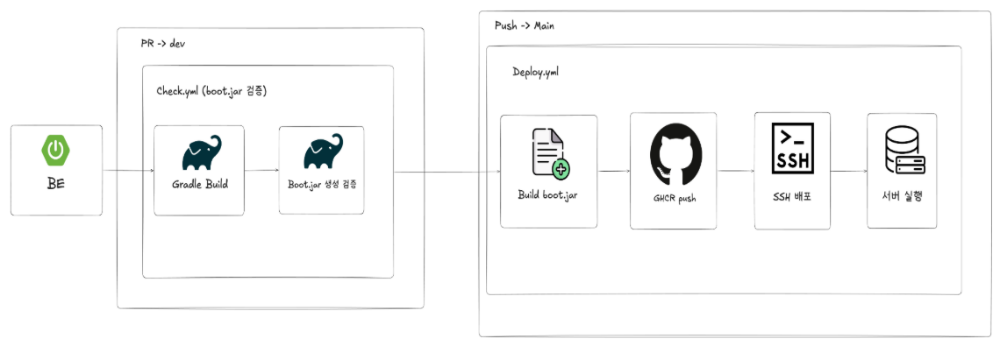
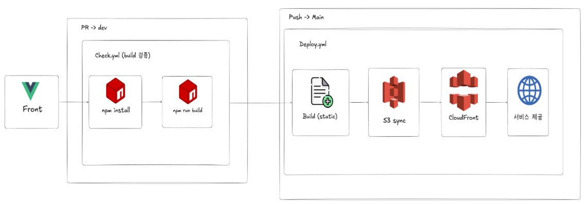
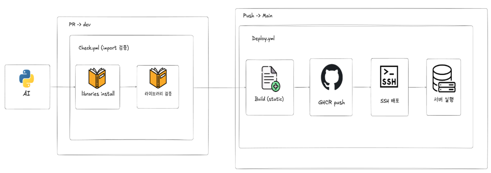
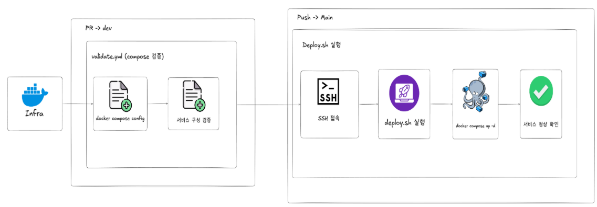

# AI 기반 사내 지식 공유 플랫폼


</details>

<br>


## 🤝 팀원 소개
<table>
  <tr>
    <td align="center" width="16%">
      </a>
      <b>김진혁(팀장)</b><br>
      <a href="https://github.com/jin605"></a>
    </td>
    <td align="center" width="16%">
      </a>
      <b>김가영</b><br>
      <a href="https://github.com/gahyoung920-eng"></a>
    </td>
    <td align="center" width="16%">
      </a>
      <b>민정기</b><br>
      <a href="https://github.com/calendar3450"></a>
    </td>
    <td align="center" width="16%">
      </a>
      <b>이슬이</b><br>
      <a href="https://github.com/0lthree"></a>
    </td>
    <td align="center" width="16%">
      </a>
      <b>황희수</b><br>
      <a href="https://github.com/huisu73"></a>
    </td>
        <td align="center" width="16%">
      <b>고명진(멘토)</b>
    </td>
  </tr>
</table>

<br>


## 🚩 목차

0. [배경](#0-배경)
1. [프로젝트 기획서](#1-프로젝트-기획서)
2. [요구사항 명세서](#2-요구사항-명세서)
3. [WBS](#3-WBS)
4. [ERD](#4-ERD)
5. [시스템 아키텍처](#5-시스템-아키텍처)
6. [화면설계서](#6-화면설계서)
7. [API 명세서](#7-API-명세서)
8. [백엔드 테스트 보고서](#8-백엔드-테스트-보고서)
9. [프론트엔드 테스트 보고서](#9-프론트엔드-테스트-보고서)
10. [통합 테스트 보고서](#10-통합-테스트-보고서)
11. [CI/CD 계획서](#11-CI/CD-계획서)

<br>


## <a id="0-배경"></a> 0. 배경

사내 지식은 매뉴얼, 부서 문서, 사내 게시판, 메신저, 이메일 등 여러 채널에 흩어져 있어 구성원이 필요한 정보를 찾는 데 많은 시간이 소요됩니다. 또한 반복되는 질문은 담당자의 업무 부담을 높이고, 실제 처리가 필요한 요청은 메신저나 메일로 오가면서 상태와 담당 부서, 처리 이력이 명확하게 남지 않는 문제가 있었습니다.

Workipedia는 이러한 문제의식에서 출발한 사내 지식 공유 플랫폼입니다. 흩어진 지식을 자체 개발 AI 챗봇 Know-it을 통해 더 쉽게 탐색하고, 답변만으로 해결되지 않는 요청은 티켓으로 연결해 처리 흐름을 남길 수 있도록 기획했습니다.

이를 통해 단순히 정보를 검색하는 도구를 넘어, 질문과 요청이 처리 결과로 이어지고 그 결과가 다시 조직 지식으로 축적되는 지식 순환 구조를 만들고자 합니다.

<br>


## <a id="1-프로젝트-기획서"></a> 1. 프로젝트 기획서

<details>
<summary>세부사항</summary>

### 1. 개요

Workipedia는 임직원이 사내 규정, 업무 매뉴얼, 시스템 사용법, 부서별 노하우를 하나의 창구에서 질문하고 확인할 수 있는 **AI 기반 사내 지식 공유 플랫폼**입니다.

사용자는 자체 개발 AI 챗봇 **Know-it**에게 자연어로 질문할 수 있으며, Know-it은 사내 매뉴얼, 규정 문서, Worki Q&A, 승인된 지식화 데이터 등을 기반으로 답변을 제공합니다. 답변에는 관련 출처와 문서 정보를 함께 제공하여 사용자가 답변의 근거를 확인할 수 있도록 합니다.

AI 답변만으로 해결되지 않는 질문은 Worki 질문 등록 또는 담당 부서 티켓 발행으로 연결됩니다. 이후 담당자가 작성한 답변과 처리 결과는 검수와 승인을 거쳐 다시 조직 지식으로 축적되며, 이후 AI 답변 품질을 높이는 데 활용됩니다.

---

### 2. 문제 정의

기존 사내 지식은 부서별 문서, PDF 매뉴얼, 메신저, 메일, 게시판 등에 분산되어 있어 사용자가 필요한 정보를 찾기 위해 여러 채널을 직접 확인해야 했습니다. 또한 동일한 질문이 반복되더라도 답변 이력이 체계적으로 축적되지 않아 담당자의 반복 응대 부담이 지속되었습니다.

특히 단순 게시판이나 키워드 검색 방식은 문서 목록을 제공하는 데 그치기 때문에, 사용자가 직접 내용을 해석하고 최신 여부를 판단해야 하는 한계가 있습니다. 업무 요청 역시 메신저나 메일로 처리될 경우 담당 부서, 처리 상태, 처리 이력이 명확히 남지 않아 추적과 재사용이 어렵습니다.

Workipedia는 이러한 문제를 해결하기 위해 **AI 질의응답, Worki Q&A, 업무 티켓, 지식화 승인, AI 재활용**을 하나의 흐름으로 연결합니다.

---

### 3. 목표

본 프로젝트의 목표는 파편화된 사내 업무 지식을 Know-it을 중심으로 연결하여, 임직원이 필요한 정보를 더 빠르고 정확하게 찾을 수 있도록 하는 것입니다.

사용자가 자연어로 질문하면 Know-it은 RAG 기반으로 사내 매뉴얼과 Worki 지식을 검색해 답변하고, 답변의 근거가 되는 출처를 함께 제공합니다. 답변으로 해결되지 않는 요청은 Worki 질문 또는 담당 부서 티켓으로 전환하여 공식적인 답변과 처리 이력을 남깁니다.

처리 완료된 티켓과 채택된 답변은 다시 지식화되어 이후 검색과 AI 답변에 재사용됩니다. 이를 통해 Workipedia는 단순 검색 서비스를 넘어, **질문 → 답변 → 처리 → 지식화 → 재활용**으로 이어지는 사내 지식 순환 구조를 만드는 것을 목표로 합니다.

주요 목표는 다음과 같습니다.

- 전사 임직원이 하나의 창구에서 사내 지식을 자연어로 질문할 수 있도록 한다.
- Know-it이 사내 매뉴얼, Worki Q&A, 승인 지식 데이터를 근거로 답변을 제공한다.
- AI 답변에 출처와 관련 문서 정보를 함께 제공해 답변 신뢰성을 높인다.
- AI 답변이 부족한 경우 Worki 질문 등록 또는 담당 부서 티켓 발행으로 연결한다.
- 임직원이 질문에 답변하고, 질문자가 유용한 답변을 채택할 수 있도록 한다.
- 업무 요청 티켓을 담당 부서로 연결하고 처리 상태와 이력을 관리한다.
- 처리 완료된 티켓과 채택 답변을 조직 지식으로 축적한다.
- 답변 작성, 답변 채택, 티켓 처리, 지식화 승인 등 지식 공유 활동에 포인트를 부여한다.
- 포인트, 리더보드, 등급을 통해 임직원의 지식 공유 참여를 유도한다.
- 관리자가 미답변 질문, 티켓 현황, 지식화 데이터, AI 동기화 상태를 관리할 수 있도록 한다.

---

### 4. 핵심 흐름

Workipedia의 핵심 흐름은 다음과 같습니다.

```text
사용자 질문
→ Know-it AI 답변
→ 출처 기반 답변 제공
→ 미해결 시 Worki 질문 또는 티켓 발행
→ 담당자 답변 또는 부서 처리
→ 답변 채택 / 티켓 완료
→ 지식화 승인
→ AI 검색 및 답변에 재활용
```

이 흐름을 통해 일회성 질문과 처리 결과가 사라지지 않고, 조직 전체가 다시 활용할 수 있는 지식 자산으로 축적됩니다.

---

### 5. ESG 가치

Workipedia의 ESG는 별도의 장식 요소가 아니라, 사내 지식 공유와 업무 효율화 과정에서 발생하는 가치를 시각화하는 방향으로 설계했습니다.

첫째, **지식 공유 활동의 시각화**입니다. 답변 작성, 답변 채택, 티켓 처리, 지식화 승인 등 사용자의 지식 공유 활동을 포인트로 환산하고, 리더보드와 등급을 통해 참여를 유도합니다.

둘째, **조직 투명성 강화**입니다. 사내 매뉴얼과 지식 데이터의 등록, 수정, 승인, 삭제 이력을 관리하고, 관리자 작업 로그와 지식화 승인 이력을 남겨 운영 과정을 추적할 수 있도록 합니다. 이는 ESG 중 Governance 가치와 연결됩니다.

셋째, **업무 절감 효과의 시각화**입니다. AI 답변을 통해 줄어든 문서 검색 시간과 반복 문의 시간을 추정하고, 이를 전력 사용량 및 CO2 절감량으로 환산하여 보여줍니다.

```text
주간 추정 업무 절감 시간(h)
= Σ 일자별·사용자별 min(인용 포함 챗봇 답변 수 × 3분, 37.8분) ÷ 60

추정 전력 절감량(kWh)
= 주간 추정 업무 절감 시간(h) × 0.08(kW)

추정 CO2 절감량(kgCO2e)
= 추정 전력 절감량(kWh) × 0.478(kgCO2e/kWh)
```

이를 통해 Workipedia는 업무 효율 개선뿐 아니라, 지식 공유 문화 확산, 운영 투명성 강화, ESG 가치 시각화를 함께 제공하는 것을 목표로 합니다.

</details>

<br>


## <a id="2-요구사항-명세서"></a> 2. 요구사항 명세서

<details>
<summary>세부사항</summary>

[🗒️ 요구사항명세서](https://docs.google.com/spreadsheets/d/1UwKgzHGSBpIbeOFRVJ_3B759vdDhf5sKBs9VNqmtCpI/edit?gid=0#gid=0)


</details>

<br>


## <a id="3-WBS"></a> 3. WBS

<details>
<summary>세부사항</summary>

[📅 WBS](https://playdatacademy.notion.site/358d943bcac281f39953cef849482b81?v=35ed943bcac280338131000cb1fc378e)


</details>

<br>

## <a id="4-ERD"></a> 4. ERD

<details>
<summary>세부사항</summary>

[🧩 ERD](https://www.erdcloud.com/d/N5pR99x6kArMGp4Xe)


</details>

<br>


## <a id="5-시스템-아키텍처"></a> 5. 시스템 아키텍처

<details>
<summary>세부사항</summary>

[🛠️ 시스템아키텍쳐](https://excalidraw.com/#json=9v80ncfjm36Hn2IHww8A4,EI-QU18LDajObNvNnOATgA)


</details>

<br>


## <a id="6-화면설계서"></a> 6. 화면설계서

<details>
<summary>세부사항</summary>

[📱 화면설계서](https://www.figma.com/design/jleHnh9qzkjeduukiUuJws/%ED%99%94%EB%A9%B4%EA%B8%B0%EB%8A%A5%EC%84%A4%EA%B3%84%EC%84%9C?node-id=0-1&t=Y0yJvaReqcKLiOyK-1)


</details>

<br>


## <a id="7-API-명세서"></a> 7. API 명세서

<details>
<summary>세부사항</summary>

[🌐 API명세서](https://www.notion.so/playdatacademy/367d943bcac28064b9b6c422491d86bd?v=367d943bcac280189fc1000ce027a418&source=copy_link)

</details>

<br>


## <a id="8-백엔드-테스트-보고서"></a> 8. 백엔드 테스트 보고서

<details>
<summary>세부사항</summary>

[✔️ 백엔드테스트보고서](https://docs.google.com/spreadsheets/d/1UwKgzHGSBpIbeOFRVJ_3B759vdDhf5sKBs9VNqmtCpI/edit?gid=506689780#gid=506689780)


</details>


<br>


## <a id="9-프론트엔드-테스트-보고서"></a> 9. 프론트엔드 테스트 보고서

<details>
<summary>세부사항</summary>

[✅ 프론트엔드테스트보고서](https://docs.google.com/spreadsheets/d/1UwKgzHGSBpIbeOFRVJ_3B759vdDhf5sKBs9VNqmtCpI/edit?gid=454562383#gid=454562383)


</details>

<br>


## <a id="10-통합-테스트-보고서"></a> 10. 통합 테스트 보고서

<details>
<summary>세부사항</summary>

[🚦 통합테스트보고서](https://docs.google.com/spreadsheets/d/1UwKgzHGSBpIbeOFRVJ_3B759vdDhf5sKBs9VNqmtCpI/edit?gid=2050766396#gid=2050766396)


</details>

<br>


## <a id="11-CI/CD-계획서"></a> 11. CI/CD 계획서

<details>
<summary>세부사항</summary>

[⚙️ CI/CD계획서](https://github.com/beyond-sw-camp/be25-fin-WIP-Workipedia-be/wiki/CICD-Test)





</details>

<br>

## <a id="12-회고록"></a> 12. 회고록 

<details>

#### 🐵 김진혁 :
> 흠냐링흠냠냠

#### 🐶 김가영 :
>

#### 🐴 민정기 :
>

#### 🐸 이슬이 :
>

#### 🐰 황희수 :

</details>


> 

<br>

