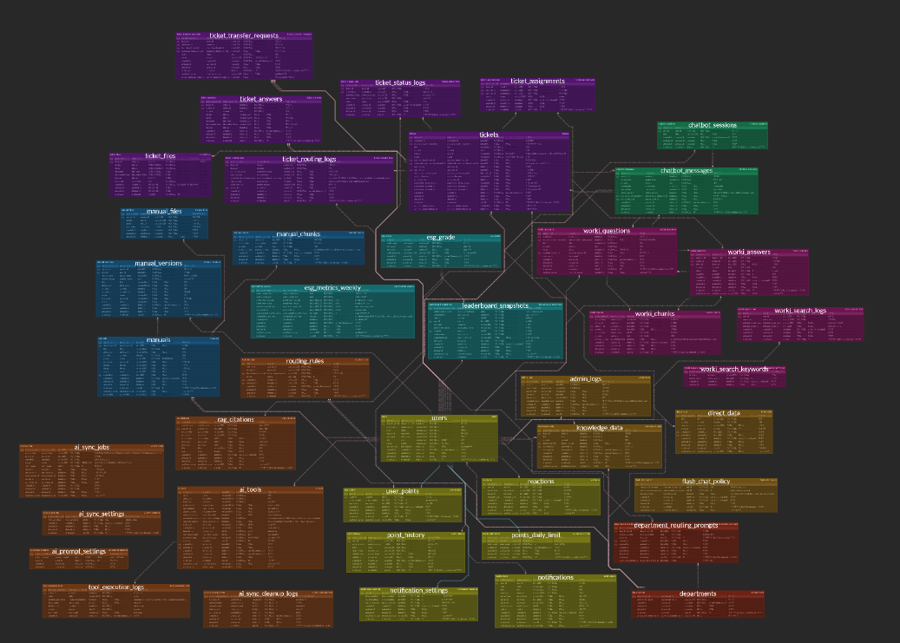

# Workipedia
### AI 기반 노잇을 통한 사내 지식 공유 플랫폼

<br>


## 🤝 팀원 소개
<table>
  <tr>
    <td align="center" width="20%">
      </a>
      <b>김진혁</b><br>
      <a href="https://github.com/jin605"></a>
    </td>
    <td align="center" width="20%">
      </a>
      <b>김가영</b><br>
      <a href="https://github.com/gahyoung920-eng"></a>
    </td>
    <td align="center" width="20%">
      </a>
      <b>민정기</b><br>
      <a href="https://github.com/calendar3450"></a>
    </td>
    <td align="center" width="20%">
      </a>
      <b>이슬이</b><br>
      <a href="https://github.com/0lthree"></a>
    </td>
    <td align="center" width="20%">
      </a>
      <b>황희수</b><br>
      <a href="https://github.com/huisu73"></a>
    </td>
  </tr>
</table>

<br>


## 🚩 목차

0. [프로젝트 배경](#0-프로젝트-배경)
1. [프로젝트 기획서](#1-프로젝트-기획서)
2. [요구사항 명세서](#2-요구사항-명세서)
3. [WBS](#3-WBS)
4. [ERD](#4-ERD)
5. [시스템 아키텍처](#5-시스템-아키텍처)
6. [화면설계서](#6-화면설계서)
7. [API 명세서](#7-API-명세서)
8. [백엔드 테스트 보고서](#8-백엔드-테스트-보고서)
9. [프론트엔드 테스트 보고서](#9-프론트엔드-테스트-보고서)

<br>


## <a id="0-프로젝트-배경 a"></a> 0. 프로젝트 배경

임직원은 업무를 수행하는 과정에서 사내 규정, 업무 매뉴얼, 시스템 사용법, 부서별 처리 기준 등 다양한 정보를 빠르게 확인해야 한다.

하지만 실제 업무 환경에서는 관련 정보가 메일, 사내 게시판, 메신저, PDF 매뉴얼, 부서별 문서, 기존 질의응답 등 여러 채널에 분산되어 있어 필요한 내용을 찾기 어렵다. 이러한 구조에서는 임직원이 정보를 탐색하는 데 많은 시간을 소비하게 되고, 담당 부서나 업무 담당자는 동일한 질문에 반복적으로 응답해야 하는 문제가 발생한다.

또한 기존 사내 커뮤니티나 게시판은 단순 게시글 등록과 검색 기능 중심으로 운영되는 경우가 많아, 업무 관련 질문에 대한 정확한 답변 제공, 출처 확인, 담당 부서 연결, 답변 이력의 지식화에는 한계가 있다. 특히 한화의 사내 익명 커뮤니티인 사이다 역시 임직원 간 소통과 커뮤니티 성격에 더 가깝기 때문에, 사내 규정과 업무 지식을 체계적으로 관리하는 플랫폼으로 활용하기에는 부족한 부분이 있다.

본 프로젝트는 이러한 문제를 해결하기 위해, 사내 규정·업무 매뉴얼·FAQ·부서별 노하우·채택 답변을 통합 관리하는 **AI 기반 사내 지식 공유 플랫폼**을 구축하는 것을 목표로 한다.

---

사용자는 하나의 검색창에서 업무 관련 질문을 입력하면, 시스템이 사내 위키, 매뉴얼, FAQ, 워키 게시판, 기존 채택 답변 등을 통합 검색하고, RAG 기반 AI 챗봇이 출처가 포함된 요약 답변을 제공한다. 사용자는 단순히 문서 목록을 확인하는 것이 아니라, 실제 질문에 맞는 답변과 근거 문서를 함께 확인할 수 있다.

만약 AI 답변만으로 문제가 해결되지 않거나 담당 부서의 공식적인 확인이 필요한 경우에는 워키 질문으로 등록하거나 담당 부서 티켓을 생성할 수 있다. 이후 임직원 또는 담당자가 답변을 작성하고, 질문자가 답변을 채택하면 해당 답변은 다시 사내 지식으로 축적된다. 축적된 지식은 이후 AI 검색 대상에 반영되어 다음 질문의 답변 품질을 높이는 데 활용된다.

이를 통해 단순히 정보를 조회하는 수준을 넘어,

```text
검색 → AI 답변 → 미해결 질문 등록/티켓 발행 → 담당자 답변 → 답변 채택 → 지식 축적 → 재검색
```

으로 이어지는 순환 구조의 사내 지식 관리 시스템을 구현하고자 한다.

결과적으로 본 프로젝트는 반복 문의를 줄이고, 임직원의 업무 정보 접근성을 높이며, 조직 내 지식이 개인이나 부서에 머무르지 않고 지속적으로 축적·재사용될 수 있는 환경을 제공한다.


<br>


## <a id="1-프로젝트-기획서"></a> 1. 프로젝트 기획서

<details>
<summary>세부사항</summary>

### 1. 개요

본 프로젝트는 임직원이 사내 규정, 업무 매뉴얼, 시스템 사용법, 부서별 노하우를 하나의 창구에서 질문하고 확인할 수 있는 **AI 기반 사내 지식 공유 플랫폼**이다.

사용자는 AI 어시스턴트 **노잇**에게 자연어로 질문하고, 노잇은 사내 매뉴얼, 규정집, 워키 게시판, FAQ, 채택 답변 등을 기반으로 답변을 제공한다. 답변에는 출처 하이퍼링크와 관련 문서를 함께 제공하여 신뢰성을 높인다.

AI 답변으로 해결되지 않는 질문은 워키 질문 등록 또는 담당 부서 티켓 발행으로 연결되며, 이후 작성된 답변은 다시 사내 지식으로 축적된다.

---

### 2. 배경 및 문제 정의

한화 계열사에는 **사이다**라는 익명 커뮤니티가 있지만, 업무 지식 관리보다는 임직원 간 소통과 커뮤니티 성격에 가깝다. 또한 단순 익명 게시판과 검색 기능 중심이기 때문에, 사내 규정이나 업무 매뉴얼처럼 정확성과 출처가 중요한 정보를 체계적으로 관리하기에는 한계가 있다.

현재 사내 지식은 부서별 문서, PDF 매뉴얼, 메신저, 메일, 게시판 등에 분산되어 있다. 이로 인해 임직원은 필요한 정보를 찾기 위해 여러 문서를 직접 확인해야 하고, 담당자는 동일한 질문에 반복적으로 답변해야 한다.

특히 기존 검색 방식은 문서 목록만 제공하기 때문에 사용자가 직접 내용을 해석해야 하며, 이미 해결된 질문도 조직의 지식으로 축적되지 못한다. 결과적으로 지식은 계속 파편화되고, 반복 문의와 업무 비효율이 발생한다.

---

### 3. 목표

본 프로젝트의 목표는 한화 내부의 파편화된 업무 지식을 AI 챗봇을 중심으로 연결하여, 임직원이 필요한 정보를 빠르고 정확하게 찾을 수 있도록 하는 것이다.

이를 위해 사용자가 자연어로 질문하면 RAG 기반 챗봇이 사내 매뉴얼과 워키를 검색해 답변하고, 답변의 근거가 되는 출처를 함께 제공한다.

또한 AI 답변으로 해결되지 않는 질문은 워키 게시판이나 담당 부서 티켓으로 연결하여 공식적인 답변과 처리 이력을 남긴다. 채택된 답변은 다시 지식으로 축적되어 이후 AI 답변 품질을 높이는 데 활용된다.

주요 목표는 다음과 같다.
```
전사 임직원이 하나의 검색창에서 사내 지식을 질문할 수 있도록 한다.
RAG 챗봇이 사내 매뉴얼과 워키를 근거로 답변을 제공한다.
AI 답변에는 출처 하이퍼링크와 관련 문서 목록을 제공한다.
AI 답변이 부족하면 워키 질문 등록 또는 담당 부서 티켓 발행으로 연결한다.
임직원이 질문에 답변하고 질문자가 답변을 채택할 수 있도록 한다.
답변 작성, 채택, 로그인 등 활동에 포인트를 부여한다.
포인트, 리더보드, 등급/뱃지를 통해 지식 공유 참여를 유도한다.
관리자가 미답변 질문, 티켓 현황, 포인트 현황, 문서 업데이트 현황을 관리할 수 있도록 한다.
주기적으로 워키/매뉴얼 임베딩을 갱신하여 검색 품질을 유지한다.
```

결과적으로 본 서비스는 **질문 → AI 답변 → 미해결 질문 연결 → 담당자 답변 → 채택 → 지식 축적 → AI 재활용**으로 이어지는 사내 지식 순환 구조를 만드는 것을 목표로 한다.

---

### 4. ESG

본 프로젝트의 ESG는 사내 지식 관리와 업무 효율화 과정에서 발생하는 부가 가치로 설계한다.

첫째, **ESG 시각화**를 제공한다. 답변 작성, 채택 답변, 문서 기여, 티켓 해결 등 사용자의 지식 공유 활동을 포인트로 환산하고, 이를 리더보드, 등급, 뱃지, 성장형 오브젝트 등으로 시각화한다.

둘째, **사내 규정 버전 관리를 통한 조직 투명화**를 실현한다. 사내 규정과 매뉴얼의 변경 이력, 수정 내용, 현재 적용 버전을 관리하여 구성원이 최신 규정을 확인할 수 있도록 한다. 이는 ESG 중 Governance에 해당하며, 규정 변경의 투명성과 신뢰성을 높인다.

셋째, **절감 시간 기반 전력 및 CO2 절감량 시각화**를 제공한다. AI 답변을 통해 줄어든 문서 검색 시간과 반복 문의 시간을 누적하고, 이를 업무용 PC 사용 전력 및 CO2 절감량으로 환산해 보여준다.

```text
주간 추정 업무 절감 시간(h)
= Σ 일자별·사용자별 min(인용 포함 챗봇 답변 수 × 3분, 37.8분) ÷ 60

추정 전력 절감량(kWh)
= 주간 추정 업무 절감 시간(h) × 0.08(kW)

추정 CO2 절감량(kgCO2e)
= 추정 전력 절감량(kWh) × 0.478(kgCO2e/kWh)

스마트폰 충전 환산 횟수
= 추정 CO2 절감량(kgCO2e) ÷ 0.0124(kgCO2/회)
```

이를 통해 본 프로젝트는 업무 효율 개선뿐만 아니라, 조직 투명성 강화와 ESG 가치 시각화까지 함께 제공한다.

</details>

<br>


## <a id="2-요구사항-명세서"></a> 2. 요구사항 명세서

<details>
<summary>세부사항</summary>

[🗒️ 요구사항명세서](https://docs.google.com/spreadsheets/d/1UwKgzHGSBpIbeOFRVJ_3B759vdDhf5sKBs9VNqmtCpI/edit?gid=0#gid=0)

</details>

<br>


## <a id="3-WBS"></a> 3. WBS

<details>
<summary>세부사항</summary>

[📅 WBS](https://playdatacademy.notion.site/358d943bcac281f39953cef849482b81?v=35ed943bcac280338131000cb1fc378e)


</details>

<br>

## <a id="4-ERD"></a> 4. ERD

<details>
<summary>세부사항</summary>

[🧩 ERD](https://www.erdcloud.com/d/N5pR99x6kArMGp4Xe)


</details>

<br>


## <a id="5-시스템-아키텍처"></a> 5. 시스템 아키텍처

<details>
<summary>세부사항</summary>


</details>

<br>


## <a id="6-화면설계서"></a> 6. 화면설계서

<details>
<summary>세부사항</summary>

[📱 화면설계서](https://www.figma.com/design/jleHnh9qzkjeduukiUuJws/%ED%99%94%EB%A9%B4%EA%B8%B0%EB%8A%A5%EC%84%A4%EA%B3%84%EC%84%9C?node-id=0-1&t=Y0yJvaReqcKLiOyK-1)


</details>

<br>


## <a id="7-API-명세서"></a> 7. API 명세서

<details>
<summary>세부사항</summary>

[🌐 API명세서](https://www.notion.so/playdatacademy/367d943bcac28064b9b6c422491d86bd?v=367d943bcac280189fc1000ce027a418&source=copy_link)

</details>

<br>


## <a id="8-백엔드-테스트-보고서"></a> 8. 백엔드 테스트 보고서

<details>
<summary>세부사항</summary>

[✔️ 백엔드테스트보고서](https://docs.google.com/spreadsheets/d/1UwKgzHGSBpIbeOFRVJ_3B759vdDhf5sKBs9VNqmtCpI/edit?gid=506689780#gid=506689780)

</details>

<br>


## <a id="9-프론트엔드-테스트-보고서"></a> 9. 프론트엔드 테스트 보고서

<details>
<summary>세부사항</summary>

[✅ 프론트엔드테스트보고서](https://docs.google.com/spreadsheets/d/1UwKgzHGSBpIbeOFRVJ_3B759vdDhf5sKBs9VNqmtCpI/edit?gid=454562383#gid=454562383)

</details>

<br>

