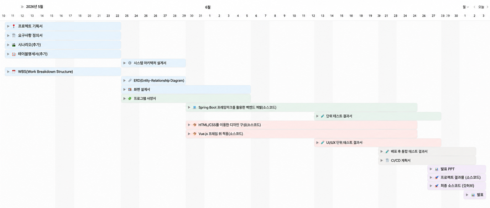

# Workipedia
AI 기반 노잇을 통한 사내 지식 공유 플랫폼

<br>


## 🤝 팀원 소개
<table>
  <tr>
    <td align="center" width="20%">
      <b>김진혁</b><br><br>
      <a href="https://github.com/jin605"></a>
    </td>
    <td align="center" width="20%">
      <b>김가영</b><br><br>
      <a href="https://github.com/gahyoung920-eng"></a>
    </td>
    <td align="center" width="20%">
      <b>민정기</b><br><br>
      <a href="https://github.com/calendar3450"></a>
    </td>
    <td align="center" width="20%">
      <b>이슬이</b><br><br>
      <a href="https://github.com/0lthree"></a>
    </td>
    <td align="center" width="20%">
      <b>황희수</b><br><br>
      <a href="https://github.com/huisu73"></a>
    </td>
  </tr>
</table>

<br>


## 🚩 목차

0. [프로젝트 배경](#0-프로젝트-배경)
1. [프로젝트 기획서](#1-프로젝트-기획서)
2. [요구사항 명세서](#2-요구사항-명세서)
3. [WBS](#3-WBS)

<br>


## <a id="0-프로젝트-배경 a"></a> 0. 프로젝트 배경

신규 입사자는 입사 초기 인사·복지·근태·교육·사내 제도 등 다양한 정보를 빠르게 파악해야 한다.

하지만 실제 업무 환경에서는 관련 정보가 메일, 사내 게시판, 메신저, PDF 매뉴얼, 온보딩 문서 등 여러 채널에 분산되어 있어 필요한 내용을 찾기 어렵다.
이러한 구조에서는 신규 입사자가 정보를 탐색하는 데 많은 시간을 소비하게 되고, HR 담당자 역시 동일한 질문에 반복적으로 응답해야 하는 문제가 발생한다. 또한 부서별 온보딩 방식 차이로 인해 조직 적응 속도와 업무 이해도에도 편차가 생길 수 있다.

본 프로젝트는 이러한 문제를 해결하기 위해, 인사·복지·근태·교육·사내 제도 관련 정보를 통합 관리하는 온보딩 지식 허브(Onboarding Knowledge Hub) 를 구축하는 것을 목표로 한다.

사용자는 하나의 검색창에서 HR 관련 질문을 입력하면, 시스템이 HR 위키, FAQ, 공지사항, 온보딩 문서, 기존 HR 문의 티켓 등을 통합 검색하여 AI 기반 요약 답변을 제공받을 수 있다.
만약 검색 결과만으로 문제가 해결되지 않거나 HR의 추가 판단이 필요한 경우에는 HR 문의 티켓을 생성할 수 있다. 이후 HR 담당자의 답변은 AI를 통해 FAQ 초안이나 온보딩 문서 형태로 재가공되며, 관리자의 승인 후 지식 허브에 다시 축적된다.

이를 통해 단순히 정보를 조회하는 수준을 넘어,
검색 → 문의 처리 → 지식 축적 → 재검색 으로 이어지는 순환 구조의 HR 지식 관리 시스템을 구현하고자 한다.

결과적으로 반복 문의를 줄이고, 신규 입사자의 온보딩 경험을 개선하며, 조직 내 인사 지식이 지속적으로 축적·재사용될 수 있는 환경을 제공한다.

<br>


## <a id="1-프로젝트-기획서"></a> 1. 프로젝트 기획서

<details>
<summary>세부사항</summary>

# 프로젝트 기획서

## 1. 프로젝트 개요

### 1.1 프로젝트명

**AI 기반 노잇을 통한 사내 지식 공유 플랫폼**

### 1.2 한 줄 설명

임직원이 사내 규정, 업무 매뉴얼, 시스템 사용법, 부서별 노하우를 AI 어시스턴트 노잇에게 질문하고, 해결되지 않은 질문은 워키 게시판과 담당 부서 티켓으로 연결되며, 답변·채택·평가·포인트를 통해 사내 지식이 계속 축적되는 전사 지식 관리 플랫폼이다.

### 1.3 핵심 방향

본 프로젝트는 신입사원 온보딩 전용 시스템이 아니라, 전사 임직원이 사용하는 **사내 위키 + Q&A 게시판 + RAG 챗봇 + 티켓 처리 시스템**이다.

여기서 **노잇**은 `Know it`에서 착안한 AI 어시스턴트 이름으로, 임직원이 궁금한 업무 정보를 질문하면 사내 문서·워키·FAQ·채택 답변을 근거로 답변하고, 해결되지 않은 질문은 워키 또는 티켓으로 연결한다.

```
질문 입력
→ RAG 챗봇이 사내 매뉴얼/워키 기반 답변 제공
→ 답변 근거와 관련 문서 표시
→ 해결되지 않으면 워키 질문 등록 또는 담당 부서 티켓 발행
→ 임직원/담당자가 답변
→ 질문자가 답변 채택
→ 좋은 답변은 포인트 지급 및 위키 지식으로 축적
→ 주기적으로 임베딩 갱신
→ 다음 질문의 답변 품질 향상
```

---

## 2. 프로젝트 배경

회사 내부에는 업무에 필요한 정보가 여러 곳에 흩어져 있다.

```
휴가 신청은 어디서 하나요?
법인카드 사용 기준은 어떻게 되나요?
출장비 정산은 언제까지 해야 하나요?
개발 서버 접속 권한은 어디에 요청하나요?
보안 교육 수료증은 어디서 확인하나요?
프로젝트 산출물 양식은 어디에 있나요?
특정 업무 담당 부서는 어디인가요?
사내 시스템 오류는 누구에게 문의해야 하나요?
```

기존 방식에서는 이런 질문이 메신저, 메일, 구두 문의, 부서별 문서, PDF 매뉴얼, 사내 게시판에 분산된다. 그 결과 사용자는 같은 질문을 반복해서 물어보고, 담당자는 동일한 답변을 계속 반복하며, 이미 해결된 지식도 다시 검색되기 어렵다.

따라서 본 프로젝트는 사내 매뉴얼과 워키 게시판을 기반으로 임직원의 질문을 먼저 AI 챗봇이 처리하고, 해결되지 않는 질문은 사람의 답변과 티켓 프로세스로 연결하여 사내 지식을 지속적으로 축적하는 것을 목표로 한다.

---

## 3. 문제 정의

### 기존 사내 지식 관리의 문제점

1. **지식 분산**
    - 규정, 매뉴얼, FAQ, 부서별 노하우가 여러 시스템에 흩어져 있다.
    - 사용자는 어떤 문서를 봐야 하는지부터 알기 어렵다.
2. **반복 문의 증가**
    - 동일한 질문이 메신저, 메일, 게시판으로 반복된다.
    - 담당자는 매번 같은 내용을 다시 설명해야 한다.
3. **답변 이력의 지식화 부족**
    - 누가 어떤 질문을 했고, 어떤 답변이 실제로 도움이 되었는지 축적되지 않는다.
    - 좋은 답변이 있어도 검색 가능한 위키 지식으로 전환되지 않는다.
4. **담당 부서 연결의 어려움**
    - 질문자가 어떤 부서에 물어봐야 하는지 모르는 경우가 많다.
    - 잘못 배정된 티켓이 방치되거나 부서 간 책임 회피가 발생할 수 있다.
5. **검색 결과의 활용성 부족**
    - 단순 키워드 검색은 문서 목록만 보여준다.
    - 사용자는 여러 문서를 직접 열어 내용을 해석해야 한다.
6. **참여 유인 부족**
    - 사내 Q&A에 답변을 작성해도 보상이 없다.
    - 지식 공유가 개인의 선의에만 의존한다.

---

## 4. 프로젝트 목표

### 주요 목표

- 전사 임직원이 하나의 검색창에서 사내 지식을 질문할 수 있도록 한다.
- RAG 챗봇이 사내 매뉴얼과 워키를 근거로 답변을 제공한다.
- AI 답변에는 반드시 출처 하이퍼링크와 관련 문서 목록을 제공한다.
- AI 답변이 부족하면 워키 질문 등록 또는 담당 부서 티켓 발행으로 연결한다.
- 임직원이 질문에 답변하고 질문자가 답변을 채택할 수 있도록 한다.
- 답변 작성, 채택, 로그인 등 활동에 포인트를 부여한다.
- 포인트, 리더보드, 등급/뱃지를 통해 지식 공유 참여를 유도한다.
- 관리자가 미답변 질문, 티켓 현황, 포인트 현황, 문서 업데이트 현황을 관리할 수 있도록 한다.
- 주기적으로 워키/매뉴얼 임베딩을 갱신하여 검색 품질을 유지한다.

</details>

<br>


## <a id="2-요구사항-명세서"></a> 2. 요구사항 명세서

<details>
<summary>세부사항</summary>

[🗒️ 요구사항명세서](https://docs.google.com/spreadsheets/d/1UwKgzHGSBpIbeOFRVJ_3B759vdDhf5sKBs9VNqmtCpI/edit?gid=0#gid=0)

</details>

<br>


## <a id="3-WBS"></a> 3. WBS

<details>
<summary>세부사항</summary>

[📅 WBS](https://playdatacademy.notion.site/358d943bcac281f39953cef849482b81?v=35ed943bcac280338131000cb1fc378e)


</details>

<br>

